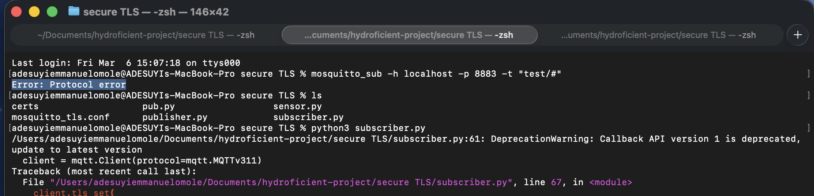
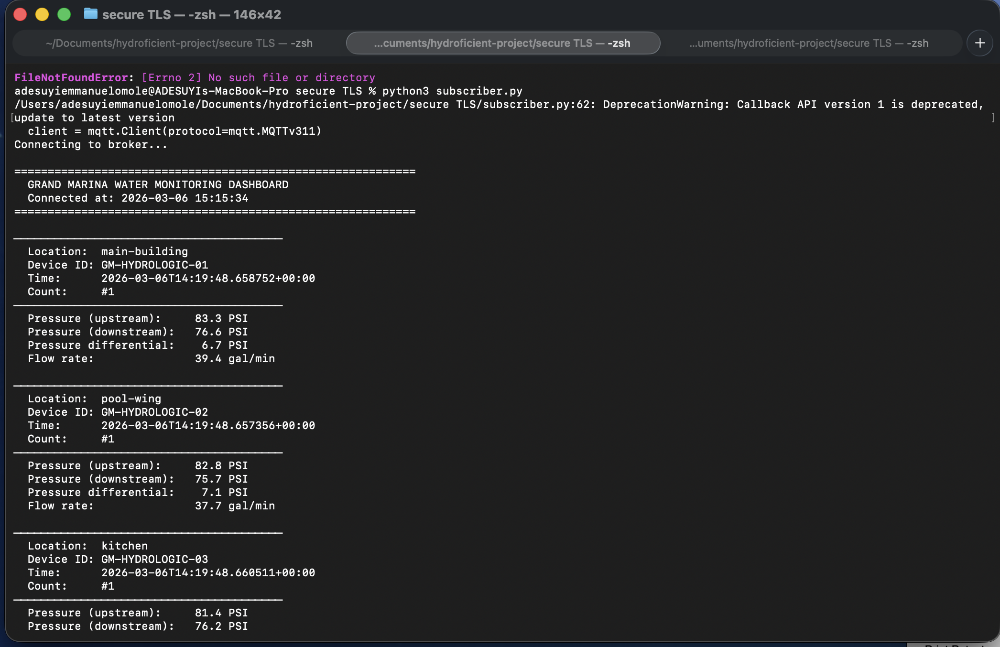

# Overview
In this project, from the previous insecure pipeline, we will add one way TLS for encryption and broker authentication. The subscriber, publisher will verify the broker's identity before transferring readings. This prevents attackers from setting up a fake broker and stealing readings from sensors. Additionally, readings will be encrypted in transit so anyone other than the broker can't view our data.

# Protections added to pipeline:
1. Encryption
2. Authentication (server or/and client proves they are not an imposter) 
3. Data modification in transit protection (message integrity check)

# One Way TLS Handshake Overview
1. Sensor will send hello to mosquitto broker.

2. Broker will send its server certificate.

3. Sensor will use CA certificate to check if the server certificate is signed by the CA.

4. Encrypted data will be sent using server's public key, which can only be decrypted by server's private key. This makes sure only the real server holding the private key can decrypt data.

# Set up instructions
### 1. Generate key and certificates
Generate CA and server keys, certificates using the generate_certs.py file:
```
python3 generate_certs.py
```

### 2. Upgrade subscriber.py and publisher.py files to use TLS encryption
Change this line to connect over port 8883 (MQTTS) instead of 1883.
```
mqttc.connect("localhost", 8883)
```

Add this line to provide CA certificate path:
```
mqttc.tls_set('certs/ca.pem')
```

# After the previous edits to the subscriber and publisher.py files. Open your terminal and run the following prompts.

### 3. Configure Mosquitto Broker to Use Certificates
Put [mosquitto_tls.conf](mosquitto_tls.conf) file in directory. This file will tell mosquitto broker to use port 8883 (TLS) and which certificates and paths to use. 

### 4. Security Tests
This step is to confirm if external party can connect to our MQTT broker. To do this, run
```
mosquitto_sub -h localhost -p 8883 -t "test/#"
```


Tests passed:
* Eavesdropping (no ca certificate)
* Expired certificate test
* Wrong certificate


### 5. Test if TLS is working when connected to the broker
Start mosquitto broker with TLS configuration (provide proper path to conf file):
```
mosquitto -c mosquitto_tls.conf -v      
```

On another terminal, run publisher.py:
```
python3 publisher.py
```

This will start publishing readings.

On another terminal, run subscriber.py:
```
python3 subscriber.py
```



# Vulnerability
In this set up, only the broker is being authenticated, not the sensor. That means anyone with the CA certificate can create a fake sensor and send fake readings to broker. In mTLS (mutual TLS), both broker and sensors will be authenticated using CA's signature.
