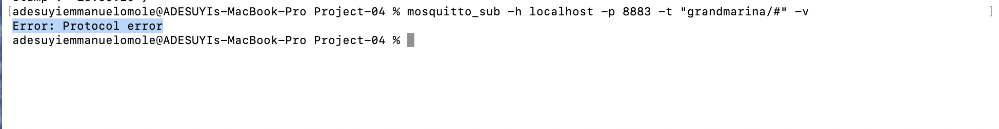
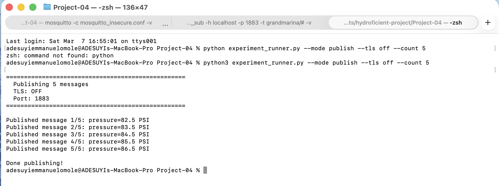
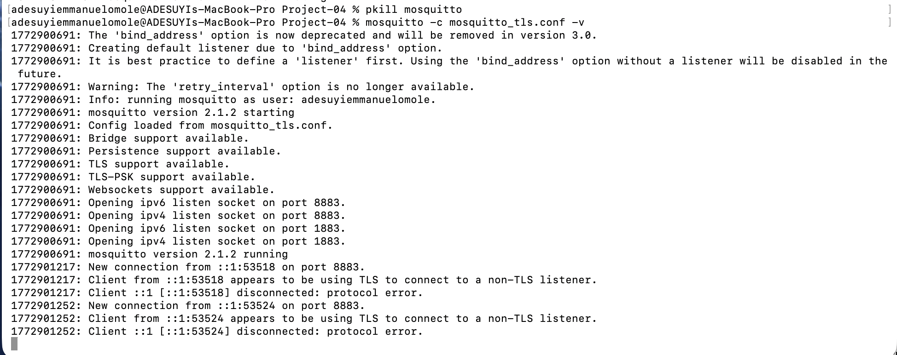
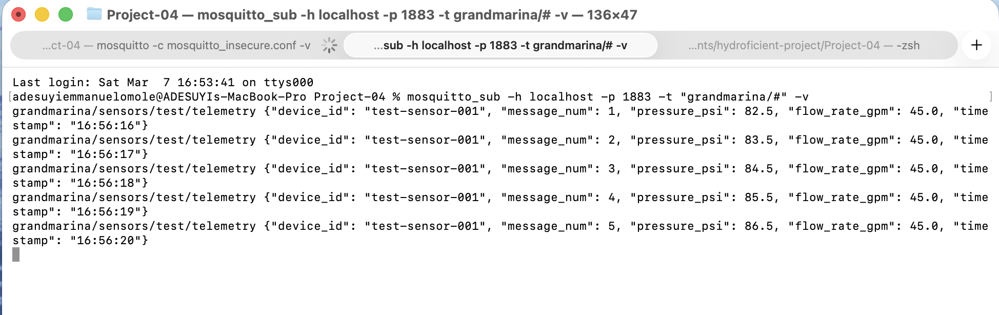
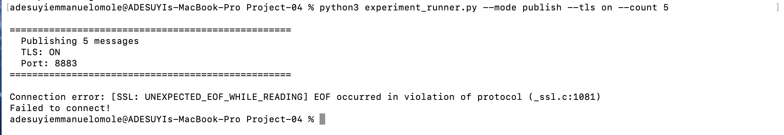

# Overview

In this test, we will be working as a penetration tester in order to prove our security actually works: an eavesdropper test, a certificate test, a speed test, and a stress test. 

# Eavesdrop test
Part A: Without TLS (Insecure)
Open three separate terminal windows and run each command in its own terminal:
Terminal 1 — Start insecure broker:
```
mosquitto -c mosquitto_insecure.conf -v
```


Terminal 2 — Be the eavesdropper:
```
mosquitto_sub -h localhost -p 1883 -t "grandmarina/#" -v
```

Terminal 3 — Publish sensor data:
```
python experiment_runner.py --mode publish --tls off --count 5
```


Part B: With TLS (Secure)
we will be using the same three terminal windows. Stop the running commands in each one with Ctrl+C, then run the new commands below.
Terminal 1 — Stop insecure broker (Ctrl+C), start TLS broker:
```
mosquitto -c mosquitto_tls.conf -v
```


Terminal 2 — Try to eavesdrop (without certificates):
```
mosquitto_sub -h localhost -p 8883 -t "grandmarina/#" -v
```


Error: A TLS error occurred.
Terminal 3 — Publish with TLS (proper certificates):
```
python experiment_runner.py --mode publish --tls on --count 5
```


The result: The eavesdropper can't connect. Messages are sent securely. TLS works!

# Certificate test

### Scenario A: Correct Certificates (Should Succeed)
The connection should work if the certificates are correct
```
python experiment_runner.py --mode connect --tls on
```
Expected output:
==================================================
  Connection Test
  TLS: ON
  CA Certificate: certs/ca.pem
==================================================

SUCCESS: Connected to broker!
Now that you know the correct setup works, let's see what happens when someone shows up with the wrong credentials.

### Scenario B: Wrong CA Certificate (Should Fail)
What if the client has a different CA certificate? This simulates connecting to a fake broker.
First, generate a "wrong" CA (a different certificate authority) in Terminal 3:
python experiment_runner.py --mode generate-wrong-ca
Then try to connect using the wrong CA in Terminal 3:
```
python experiment_runner.py --mode test-wrong-ca
```
Expected output:
==================================================
  Connection Test
  TLS: ON
  CA Certificate: certs/wrong-ca.pem
==================================================

FAILED: [SSL: CERTIFICATE_VERIFY_FAILED] certificate verify failed: unable to get local issuer certificate
What this means: The server's certificate wasn't signed by the "wrong" CA. The client correctly rejected it. This is how TLS prevents Person-in-the-Middle attacks.

### Scenario C: No Certificate Verification (Dangerous!)
```
python experiment_runner.py --mode connect --tls on --no-ca
```
Expected output:
==================================================
  Connection Test
  TLS: ON
  CA Certificate: NONE
==================================================

SUCCESS: Connected to broker!
Wait, it succeeded? Yes, and that's the problem.
