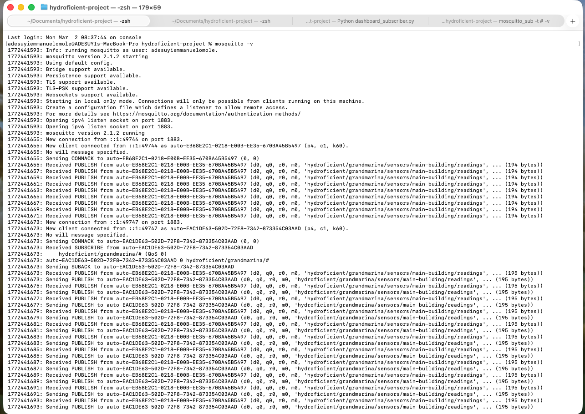
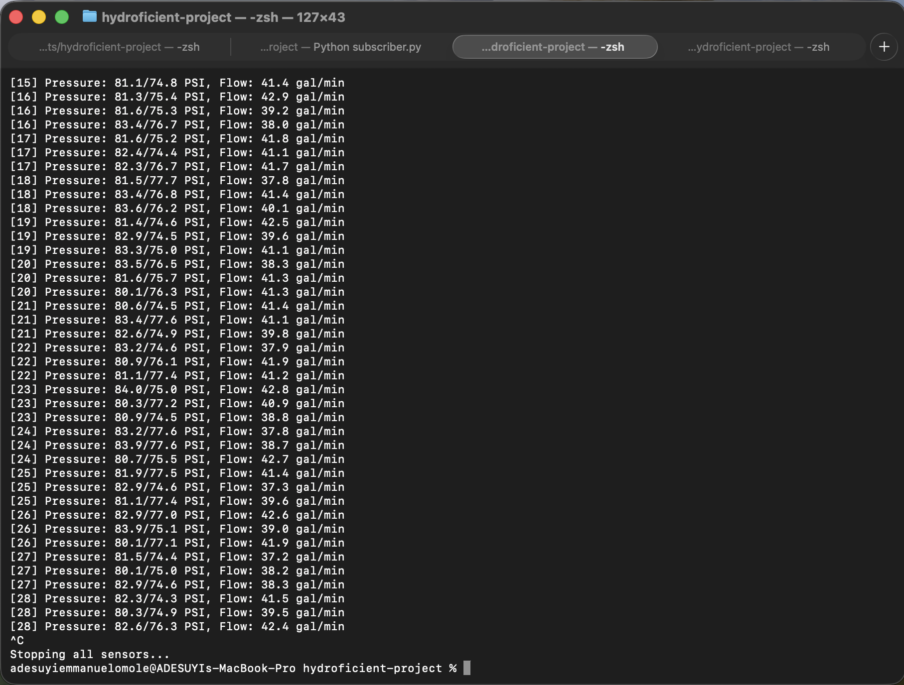
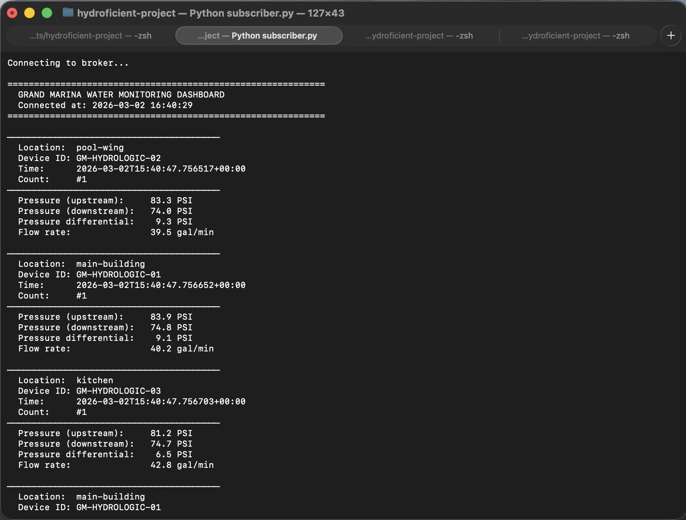
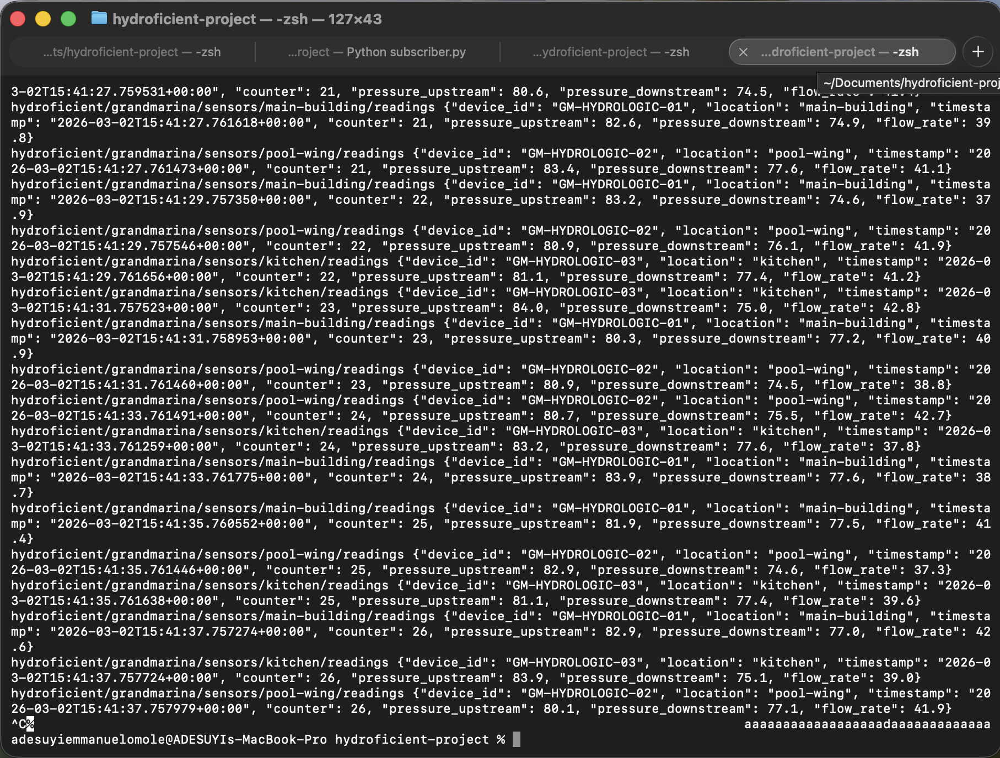

# Overview 
In this insecure pipeline created, We have a MQTT broker (mosquitto), publisher and subscriber. A python file called Publisher will publish MQTT messages (water readings) over port 1883 to Grandmarina Hotel. Subscriber (Grand Marina Hotel) will subscribe to x topic and receive all messages sent to x topic, from the three hyydrologic devices including the ones sent by publisher.

This set up is insecure because anyone can publish and subscribe to topics, it lacks authentication measures. Hence, an attacker can set up a fake broker, subscribes and capture data sent from the publisher to the subscriber.

### 1. Start mosquitto broker on terminal:
```
mosquitto -v
```

Broker will start on port 1883 (insecure, no authentication)



### 2. Start publisher in another terminal:
``` 
python3 publisher.py
```

Publisher will generate and publish messages to topic every 5 seconds.



### 3. In another terminal, start subscriber:
```
python3 subscriber.py
```

Subscriber will subscribe to the same topic and receive messages from publisher.


# Vulnerability
Keep the publisher running. In a new terminal, use a mosquitto command to subscribe to all topics.
```
mosquitto_sub -t "#"
```



Anyone with access to our network can view all messages sent to our broker (to ANY topic).
