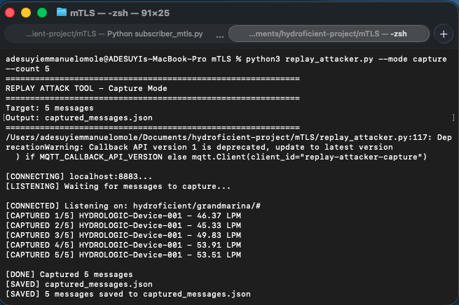
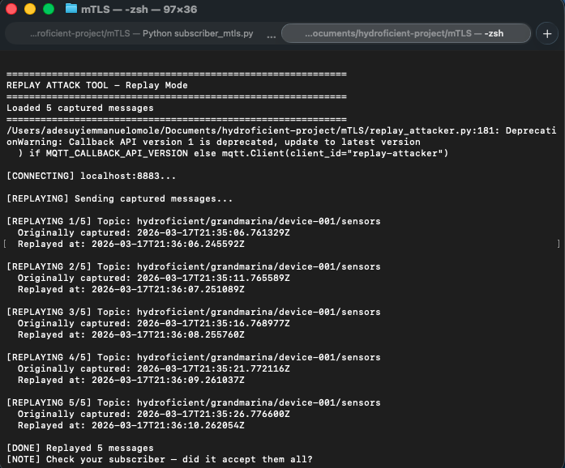
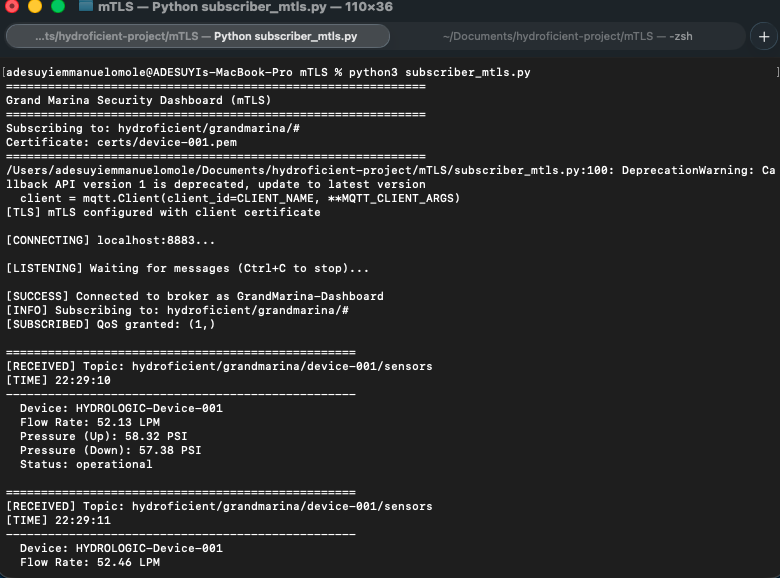

# Overview
On top of our mTLS pipeline, we will add replay attack protection (hmac signature, timestamp, sequence numbers validated). This blocks replayed messaged.

# Protections added to pipeline
1. HMAC signature (modified messages blocked).
2. Timestamp validation (aged messages blocked).
3. Sequence number validation (seen before messages blocked). 

# Prerequisites
* Generate certificates by running the command
```
python3 generate-certs.py
```
* Run mosquitto broker
```
mosquitto -c mosquitto-mtls.conf -v
```

### Before updating our subscriber and publisher file, let's see how replay attack works?

A replay attack is when someone captures a legitimate message and re-sends it later. The message itself is real — it was created by an authorized device, at a real point in time, with valid credentials.

For our devices or systems to defend against replay attack, there are 3 questions to be asked;
* Is this fresh?
* Have I seen it?
* Did the real sender create it?

### To simulate a replay attack, we need to do the following;

1. Run the mosquitto broker on port 8883
2. Run the subscriber python file (subscriber_mtls.py)
3. Run the publisher python file (Publisher_mtls.py)
4. Run the replay_attacker.py file in capture mode to record 5, 10 or 15 readings based on your preference
  ```
  python3 replay-attacker.py --mode capture --count 5
  ```
  The captured readings will be saved in a JSON format.


5. You can stop the pubisher and allow the subscriber to keep running, the goal is to replay the captured readings and replay it, we need to check if it will accept these stale readings that was captured.
```
python3 replay-attacker.py --mode replay
```


BOOOM ! BOOM !!! BOOM !!!, Our subscriber accepted the stale and replayed readings. The subscriber accepted every replayed message. It has no way to tell these are recordings from a minute ago — it treats them exactly like fresh data.




* Create shared key for hmac signature: create a .env file at root directory with this inside: ```SHARED_SECRET = your_secret_here```


### 1. Upgrade [publisher.py](publisher.py)
For every message, publisher will generate unique hmac signature, timestamp, sequence number.
A shared secret is set between publisher and subscriber for hmac signature computation. We stored this secret as a variable in development, however it should be secured tightly in production. If the secret is exposed, hmac breaks down.

### 2. Upgrade [subscriber.py](subscriber.py)
For every message, subscriber will validate:
* hmac signature
* timestamp
* sequence numbers

If recomputed hmac signature doesn't match > message was modified; rejected.
If message is too old > message rejected.
If message sequence number has been used before for that device > message rejected.

# Security Tests
### [tests.py](tests.py) view:


### [subscriber.py](subscriber.py) view:
With all 3 defenses, all of the replayed messages were successfully rejected.


### Test Findings
Can defenses stop immediate, delayed, modified replay attacks?


Individually, these 3 protections (hmac, timestamp, sequence counter) all have gaps. However, when used together, they fill each other's gap and provide strong replay protection.

# Trade Offs
### HMAC signature validation:
Low, performance impact as a hash takes only takes milliseconds to compute, especially for low byte IoT messages. 
### Timestamp validation:
Low, only a single subtraction needed.
### Sequence counter validation:
Low, only a dictionary lookup needed. Python uses hash tables which take constant O(1) for lookups, regardless of how many devices we have.
### All 3 together:
Still low, all operations are fast.
